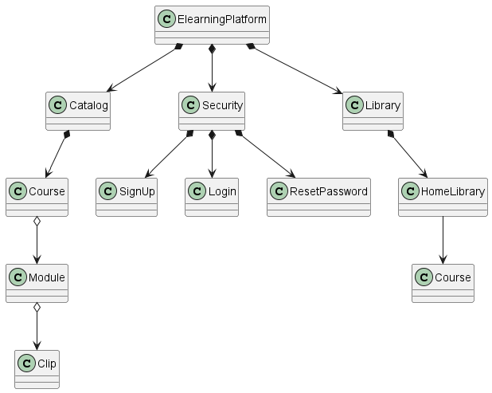
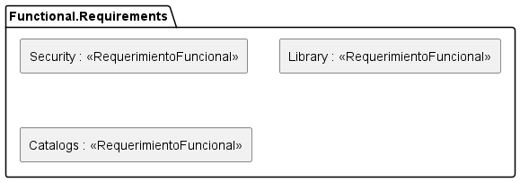

# CleanArchitectureNetCoreTemplate
Template Clean Architecture with CQRS (NET Core)

## Domain Model

## Functional Requirements

## Actors & UseCases

## High level dependencies

## Arquitecture

